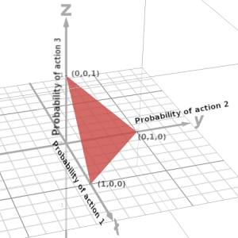

## CSE471 Assignment | Blog

# Paths to Equilibrium in Games | NeurIPS 2024

---

### **Original Authors**: Bora Yongacoglu, Gürdal Arslan, Lacra Pavel, Serdar Yüisel

##### **Blog Authors**: Ashrafur Rahman, Fatema Tuj Johora, Mashroor Hasan Bhuiyan

---

## Introduction

In Multi-Agent Reinforcement Learning (MARL) and game theory, agents interact repeatedly and update their strategies based on the outcomes they observe. A key question in this area is:  
**For a given game and starting strategy, can we always create a path that eventually leads to an equilibrium?**
 
This paper focuses on answering this question and shows that for any finite $n$-player normal-form game and any starting strategy, it is always possible to create such a path. The study also shows that sometimes making counterintuitive changes to strategy changes, e.g. temporarily lower rewards, are essential for reaching equilibrium. These findings are important for improving MARL algorithms, helping them reach equilibrium more effectively.

## Definitions:

### Multi-Agent Reinforcement Learning (MARL)

In MARL, multiple agents interact within an environment to achieve individual or collective goals. Each agent iteratively updates its strategy based on observations and feedbaci. While MARL has seen significant success in cooperative and adversarial scenarios, achieving convergence to equilibrium in complex, multi-agent environments remains a challenge.

### Normal-Form Games and Nash Equilibrium

A _normal-form game_ is a mathematical representation of a strategic interaction where a finite set of players each select a strategy simultaneously from their respective sets of available actions. The outcome of the game is determined by the combination of chosen strategies, with each player receiving a reward based on this outcome.

### Nash Equilibrium

Imagine a group of friends deciding what to do on a weekend. Each friend has their preferences (movies, bowling, or staying home), and their happiness depends not only on what they choose but also on what others decide.
A Nash equilibrium happens when everyone has made their choice, and no one can be happier by changing their mind—as long as everyone else sticks to their own decision.
Finding Nash equilibria is central to MARL but is often computationally challenging due to the coupled nature of the reward functions and the high-dimensional strategy space.

---

## Problem Statement

The authors investigate whether **satisficing paths**—strategy update sequences where satisfied agents (those already using their best response) do not change their strategies, and unsatisfied agents freely explore—can always lead to a Nash equilibrium in finite normal-form games.

### Core Question

For any finite normal-form game and any initial strategy profile, can we construct a satisficing path that guarantees convergence to Nash equilibrium?

### Key Insight

The paper proves that such a path always exists. Interestingly, this result leverages **suboptimal updates**—a departure from conventional reward improving approaches to achieve equilibrium and avoid cyclical behaviors.

---

## Mathematical Framework

### Game Representation

A finite $n$-player normal-form game $\Gamma$ is defined by:

1. $n$: Number of players.
2. $A = A_1 \times A_2 \times \cdots \times A_n$: Set of joint actions.
3. $r = (r_1, r_2, \ldots, r_n)$: Reward functions, where $r_i: A \to \mathbb{R}$ specifies the reward for player $i$.
4. Each player $i$ receives a reward $R_i$ based on the joint action profile $\overline{a} = (a_1, \ldots, a_n)$, where $a_i \in A_i$.

The strategy profile $x = (x_1, x_2, \ldots, x_n)$ consists of mixed strategies $x_i \in X_i = \Delta(A_i)$, where $\Delta(A_i)$ is the probability simplex over $A_i$. A player's objective is to maximize their expected reward by choosing a strategy $x_i$ from their strategy set $X_i$, where $x_i$ is a probability distribution over the action set $A_i$.

### Satisficing Paths

A sequence of strategy profiles ${x^t}_{t=1}^\infty$ is a **satisficing path** if for all players $i$:

- $x_i^{t+1} = x_i^t$ if $x_i^t$ is a best response to $x_{-i}^t$.
- $x_i^{t+1} \in X_i$ (freely updated) if $x_i^t$ is not a best response.

### Nash Equilibrium

A strategy profile $x^* = (x_1^*, x_2^*, \ldots, x_n^*)$ is a **Nash equilibrium** if no player can unilaterally improve their reward by changing their strategy:

$$
R_i(x_i^*, x_{-i}^*) \geq R_i(x_i, x_{-i}^*) \quad \forall x_i \in X_i, \quad \forall i \in \{1, \ldots, n\},
$$

where $x_{-i}^*$ represents the strategies of all players except $i$.

---

## Theorem

The central contribution of the paper is the following theorem:

_Any finite normal-form game $\Gamma$ has the satisficing paths property._

For any $x_1 \in X$, there exists a satisficing path $(x_1 , x_2, \dots, x_T)$ such that,
for some finite $T=T(x_1)$, the strategy profile $x_T$ is a Nash equilibrium.

We attempt to outline the proof steps of the theorem, sacrificing some rigour for an easier first read.
Lets define some notations and functions to make our lives easier.

## Some Notations

Let $\Gamma$ be a finite $n$-player normal-form game.

Let $\mathbf{x} \in \mathbf{X}$ be a mixed strategy profile at some time step.

Based on $\mathbf{x}$, we can divide the players $[n]$ in to two disjoint sets,

- **Satisfied Players:**
  $$\text{Sat}(\mathbf{x}) = \{i \in [n] : x_i \in \text{BR}^i_0(x_{-i})\}$$
  The players whose strategies are a best response to their
  opponents' strategies $\mathbf{x}^{-i}$.
- **Unsatisfied Players:**
  $$
  \begin{align*}
  \text{UnSat}(\mathbf{x})
  &= \{i \in [n] : x_i \notin \text{BR}^i_0(x_{-i})\} \\
  &= [n] \setminus \text{Sat}(x) \\
  \end{align*}
  $$
  The players whose strategies are not a best response to their
  opponents' strategies.

Some subsets of the set strategies $\mathbf{X}$ is of particular interest to us:

- **Acessible Strategies** $\text{Access}(\mathbf{x})$:

  $$
      \text{Access}(\mathbf{x}) = \{
          \mathbf{y} \in \mathbf{X}: y^i=x^i,
          \forall i \in \text{Sat}(\mathbf{x})
       \}
  $$

  These are the strategies that can be chosen after $\mathbf{x}$
  since we are restricting the paths to be satisficing.
  The strategies that can be chosen after $\mathbf{x}$ must share the
  same strategy for the players in $\text{Sat}(\mathbf{x})$.

- **No Better Strategies**
  $\text{NoBetter}(\mathbf{x}) \subseteq \text{Access}(\mathbf{x})$:

  $$
        \text{NoBetter}(\mathbf{x}) = \{
            \mathbf{y} \in \text{Access}(\mathbf{x}):
            \text{UnSat}(\mathbf{x}) \subseteq \text{UnSat}(\mathbf{y})
         \}
  $$

  These are the accessible strategies that do not satisfy any player
  who were previously unsatisfied but might make a previously satisfied
  player unsatisfied. As a consequence,
  $|\text{UnSat}(\mathbf{x_{t+1}})|\ge|\text{UnSat}(\mathbf{x_{t}})|$.

  It is obvious that $\mathbf{x} \in \text{NoBetter}(\mathbf{x})$
  since $\text{UnSat}(\mathbf{x}) \subseteq \text{UnSat}(\mathbf{x})$.

- **Worse Strategies**
  $\text{Worse}(\mathbf{x}) \subseteq \text{NoBetter}(\mathbf{x})$:

  $$
        \text{Worse}(\mathbf{x}) = \{
            \mathbf{y} \in \text{NoBetter}(\mathbf{x}):
            \text{UnSat}(\mathbf{x}) \subsetneq \text{UnSat}(\mathbf{y})
         \}
  $$

  These are the accessible strategies that make the situation worse
  by making at least one previously satisfied player, unsatisfied. Additionally,
  all previously unsatisfied players remain unsatisfied as before. This means,
  $|\text{UnSat}(\mathbf{x_{t+1}})|\geq|\text{UnSat}(\mathbf{x_{t}})+1|$.

  $\text{Worse}(\mathbf{x})$ can be empty (e.g. if $\text{UnSat}(\mathbf{x}=[n]$).

## Expected Reward Function

**Expected Reward Function $R^i(\mathbf{x})$**:

The Expected Reward function $R^i$ for player $i$ is their expected reward
which can be defined as:

$$
R_i(\mathbf{x}) = \mathbb{E}_{\mathbf{A} \sim \mathbf{x}}[r^i(\mathbf{A})]
$$

It can be expressed as a sum of products:

$$
    R^i(\mathbf{x}) = \mathbb{E}_{\mathbf{A} \sim \mathbf{x}}[r^i(\mathbf{A})] \\
    = \sum_{\bar{\mathbf{A}} \in \mathbf{A}}  r^i(\mathbf{\bar{a}})
    \mathbb{P}_{\mathbf{A} \sim \mathbf{x}}(\mathbf{A}=\bar{\mathbf{A}}) \\
    = \sum_{\bar{\mathbf{A}} \in \mathbf{A}}  r^i(\bar{a}^1,\dots,\bar{a}^n)
    \prod_{j=1}^n x_j(\bar{a}^j)
$$

We are summing over all possible actions $\mathbf{a} \in \mathbf{A}$
of all players weighted by
the probabilities of those actions under the mixed strategy profile $\mathbf{x}$.

Some properties of the expected reward function is of interest to us:

1. $R^i$ is a multi-linear function.

   This can be easily seen since

   $$
       R^i(x^i, \mathbf{x}^{-i}) =
        \sum_{\mathbf{\bar{a}} \in \mathbf{A}}
        \left [ r^i(\bar{a}^1,\dots,\bar{a}^n)
       \prod_{j \neq i} x^j(\bar{a}^j) \right ] x^i(\bar{a}^i) \\
       = \sum_{\mathbf{\bar{a}} \in \mathbf{A}}
        w_{\mathbf{x}^{-i}}(\mathbf{\bar{a}}) x^i(\bar{a}^i)
   $$

   Here, $w_{\mathbf{x}^{-i}}(\mathbf{\bar{a}}) \in \mathbb{R}$ is constant for a fixed
   $\mathbf{x}^{-i}$ and $\mathbf{\bar{a}}$. This means $R_i(x^i, \mathbf{x}^{-i})$
   is a linear function of $x^i$ if $\mathbf{x}^{-i}$ is fixed.
   Therefore, it is a multi-linear function of $\mathbf{x}$.

2. $R^i$ is continuous.

   This follows from the fact that it is a linear function.

3. Pure strategies attain the maximum expected reward when opponent strategies are fixed.

   Formally speaking, for any player $i$ and any mixed strategy profile $\mathbf{x}^{-i}$,

   $$
    \max_{x^i \in \Delta(\mathbb{A}^i)} R^i(x^i, \mathbf{x}^{-i}) =
    \max_{a^i \in \mathbb{A}^i} R^i(\delta_{a^i}, \mathbf{x}^{-i})
   $$

   This is because for fixed opponent strategies,
   the expected reward function is linear.
   Upon fixing $\mathbf{x}^{-i}$ the domain of $R_i(x^i, \mathbf{x}^{-i})$
   is the set of all mixed strategies for player $i$: $\Delta(\mathbb{A}^i)$.

   $$
   \Delta(\mathbb{A}^i) =
   \{x^i \in \mathbb{R}^{\mathbb{A}^i}:
   \sum_{a^i \in \mathbb{A}^i} x^i(a^i) = 1, x^i(a^i) \geq 0\}
   $$

   This is the probability simplex over the set of actions $\mathbb{A}^i$.
   It is a convex set, a convex shape in $|\mathbb{A}^i|$ dimensional space.
   Maximisng a linear function over a convex set
   is a linear programming problem and the maximum is attained at the
   vertices of the convex set. The vertices of the probability simplex
   are the pure strategies.

   To visualise this, consider a 3D probability simplex for a player with 3 actions
   $\mathbb{A}^i = \{1,2,3\} $.
   The probability simplex is situated on the plane $x+y+z=1$, with each axis
   representing the probability of choosing one of the actions.

   

   The maxima of a linear function over this triangle is attained at the vertices.
   Therefore, maxima are situated at either $(1,0,0)$, $(0,1,0)$ or $(0,0,1)$ which
   correspond to the pure strategies $\delta_1$, $\delta_2$ and $\delta_3$ respectively.

   Generalizing this to higher dimensions, the maximum value of the linear function
   $R^i(x^i, \mathbf{x}^{-i})$ when $\mathbf{x}^{-i}$ is fixed,
   is attained at the pure strategies $\{\delta_a^i: a^i \in \mathbb{A}^i\}$. Also note that
   if multiple pure strategies attain the maximum value, then any mixture of these
   pure strategies also attains the maximum value.

Property 3 is crucial for our proof. It implies that the maximum expected reward for player $i$
when the opponents' strategies are fixed
is that of the maximizing pure strategy.

It also implies that if $x^i$ is a best response to $\mathbf{x}^{-i}$,
then $x^i$ must be a pure strategy or a mixture of pure strategies which are best responses.

We state this formally as a lemma.

### Lemma 1

$x^i$ is a best response to $\mathbf{x}^{-i}$
if and only if $x^i$ is a mixture of pure strategies which are individually
best responses to $\mathbf{x}^{-i}$.
Formally, expressed as $x^i = \sum_{a^i \in \mathbb{A}^i} \alpha_{a^i} \delta_{a^i}$
where $\sum_{a^i \in \mathbb{A}^i} \alpha_{a^i} = 1$ and $\alpha_{a^i} \ge 0$,
$x^i \in \text{BR}^i_0(\mathbf{x}^{-i})$ if and only if
$\alpha_{a^i} \gt 0 \Rightarrow \delta_{a^i} \in \text{BR}^i_0(\mathbf{x}^{-i})$.

In other words, if $x^i$ is a best response to $\mathbf{x}^{-i}$,
then $x^i$ must be supported on the set of maximizers
$\argmax_{a^i \in \mathbb{A}^i} \{ R^i(\delta_{a^i}, \mathbf{x}^{-i})\}$. Define this best response as $\mathbf{x}_{\star}$

## Auxillary Function

## Proof outline

Now that we are done with the essential notations we can begin the proof outline.

Let $\mathbf{x}_1 \in \mathbf{X}$ be any initial strategy.
We now construct a satisficing path
$\mathbf{x}_1 , \mathbf{x}_2, \dots, \mathbf{x}_T$ of finite length $T$
where $\mathbf{x}_T$ is a Nash equilibrium.

#### **Step 1: Check Initial Strategy**

If $\mathbf{x}_1$ is a Nash equilibrium we are done.
Otherwise we continue to the next step.

#### **Step 2: Iteratively Choose Worse Strategies**

We iteratively produce a satisficing path
$\mathbf{x}_1 , \mathbf{x}_2, \dots, \mathbf{x}_t, \dots, \mathbf{x}_i$
as follows:

1. We start with the initial strategy $\mathbf{x}_1$ for $t=1$.
2. At each step, we arbitrarilly choose a worse strategy
   so that the number of unsatisfied players increases.  
   We can choose $\mathbf{x}_{t+1} \in \text{Worse}(\mathbf{x}_t)$ if
   $\text{Worse}(\mathbf{x}_t) \neq \empty$.
3. If no worse strategy is accessible from $\mathbf{x}_t$ at time step $t$
   we stop, i.e. if $\text{Sat}(\mathbf{x}_t) = \empty$
   (all players are already unsatisfied) or
   $\text{Worse}(\mathbf{x}_t) = \empty$
   (no worse strategy is accessible).

#### **Step 3: Termination within at most $n-1$ Steps**

The above process terminates in at most $n-1$ steps. Let $i$ be the
final step of the above process. We can show $i \le n - 1$.

- Initially, $|\text{UnSat}(\mathbf{x}_1)| \geq 1$ because
  $\mathbf{x}_1$ is not a Nash equilibrium and so at least one player
  wasn't satisfied.
- The number of unsatisfied players is strictly
  increasing at each time step.
  $$
    1 \leq |\text{UnSat}(\mathbf{x}_1)| < \dots
     |\text{UnSat}(\mathbf{x}_t)| < \dots
     |\text{UnSat}(\mathbf{x}_i)| \le n
  $$
- Even if at each step $|\text{UnSat}(\mathbf{x}_t)|$ increases by 1,
  $i$ can be at most $n-1$.

Therefore, the process terminates in at most $n-1$ steps and we are left
with a satisficing path $\mathbf{x}_1 , \mathbf{x}_2, \dots, \mathbf{x}_k$.

#### **Step 4: Check Last Strategy $\mathbf{x}_k$**

The process terminates at $\mathbf{x}_k$ if either all players are unsatisfied or no worse strategy is accessible.
Therefore, there are two cases:

**Case 1: $\text{Sat}(\mathbf{x}_k)=\empty$**

If all players are unsatisfied then the satisficing condition places no restrictions on the next strategy.
Therefore, we can choose any strategy $\mathbf{x}_{k+1} \in \mathbf{X}$, i.e. $\text{Access}(\mathbf{x}_k) = \mathbf{X}$.
We choose an arbitrary Nash equilibrium $\mathbf{z}_\star$ and set $\mathbf{x}_{k+1} = \mathbf{z}_\star$.

Therefore, taking $T=k+1 \le n$ we have a satisficing path $\mathbf{x}_1 , \mathbf{x}_2, \dots, \mathbf{x}_k, \mathbf{z}_\star$ where $\mathbf{z}_\star$ is a Nash equilibrium. We are done.

**Case 2:** $\text{Sat}(\mathbf{x}_k)\ne\empty$ and $\text{Worse}(\mathbf{x}_k)=\empty$

This is the trickier case. We need to show there exists a Nash equilibrium $\mathbf{x}_\star$ such that $\mathbf{x}_\star \in \text{Access}(\mathbf{x}_k)$.

#### **Step 5: Find the Nash equilibrium $\mathbf{x}_\star$**

Since $\text{Sat}(\mathbf{x}_k)\ne\empty$, we cannot change the strategies of satisfied players $\text{Sat}(\mathbf{x}_k)$.
We can hence create a new game $\Gamma'$ by restricting the strategy space of the satisfied players to their current strategies.
Let $\mathbf{\bar{x}}_\star$ be a Nash equilibrium of the new game $\Gamma'$.

## Insights and Implications

### Key Takeaways

1. **Convergence Assurance**: Satisficing paths guarantee convergence to Nash equilibrium in finite normal-form games.
2. **Breaking Cycles**: The use of suboptimal updates avoids cyclical behaviors common in adversarial dynamics.
3. **Distributed Applicability**: This approach can be implemented in decentralized systems where agents independently assess their satisfaction.

### Implications for MARL

- **Exploration and Exploitation**: The satisficing principle balances exploration (for unsatisfied agents) and exploitation (for satisfied agents).
- **Scalability**: Reducing updates for satisfied agents minimizes computational overhead in large systems.

---

## Broader Applications

### Markov Games:

A Markov game is a generalization of both normal form games (multiplayer, singleton state) and Markov Decision Process (single player, multi state). There are $n$ players and discounted rewards, described by a list 
$\mathcal{G} = (n, \mathcal{S}, \mathcal{A}, \mathcal{T}, \mathbf{r}, \gamma)$, 
where $\mathcal{S}$ is a finite set of states, 
$\mathcal{A} = \mathcal{A}^1 \times \cdots \times \mathcal{A}^n$ 
is a finite set of action profiles, and 
$\mathbf{r} = (r^1, r^2, \ldots, r^n)$ 
is a collection of reward functions, where 
$r^i: \mathcal{S} \times \mathcal{A} \to \mathbb{R}$ 
describes the reward to player $i$. 

A transition probability function 
$\mathcal{T} \in \mathcal{P}(\mathcal{S} \mid \mathcal{S} \times \mathcal{A})$ 
governs the evolution of the state process, described below, and a discount factor 
$\gamma \in (0,1)$ 
is used to aggregate rewards across time.
 

Markov games refine the Nash equilibrium concept into **Markov perfect equilibrium**, which is a key focus for MARL algorithms. The authors have attempted to generalize Theorem 1 for Markov games too by conducting the proofs parallely. 

To begin, one can construct a satisficing path $\{\pi_1, \pi_2, \dots, \pi_k\}$ by growing the set of unsatisfied players at each iteration until either $\text{UnSat}(\pi_k) = \{1, 2, \dots, n\}$ or $\text{Worse}(\pi_k) = \emptyset$. In the latter case, one can consider the subgame involving only the players in $\text{UnSat}(\pi_k)$ and obtain a Markov perfect equilibrium $\tilde{\pi}_{\star}$ for that subgame, which can then be extended to a policy profile $\pi_{\star} \in \text{Acc}(\pi_k)$ by putting 
$$
\pi^i_{\star}=  
\begin{cases} 
    \tilde{\pi}^i_{\star}, &\text{ if } i \in \text{UnSat}(\pi_k), \\
    \pi^i_k, &\text{ if } i \in \text{Sat}(\pi_k). 
\end{cases}
$$

Showing that this policy $\pi_{\star} \in \Pi$ is a Markov perfect equilibrium of the $n$-player Markov game, extends Theorem 1 to Markov games. We can define $\{f^i\}_{i = 1}^n$ analogous to the auxillary function $\{F^i\}_{i = 1}^n$ defined for normal form games which satisfy same properties e.g. the continuity and semi-definiteness properties. Hence, one possible technique for completing this proof requires extending Lemma 1 to the multi-state case. 

Unfortunately, the extension of Lemma 1 introduces unresolved states which breaks the analysis, and hence remains unproven. 

### Decentralized Learning

In many cases players can evaluate their strategy compared to an optimal strategy, even when they only have partial information. In decentralized algorithms, each player must do so using only information that they can access or estimate locally. For our case, the "win–stay" part of the satisficing principle serves as a local stopping condition, allowing the players to update their strategy without having to look at the entire strategy space. The results of this paper suggest that limitation like this can still be overcome by adapted this algorithm to broader classes of games, while still maintaining guarantees of convergence to equilibrium.

## Conclusion

This work redefines equilibrium-seeking dynamics in games by introducing satisficing paths. By allowing exploratory updates for unsatisfied agents and freezing satisfied agents, it guarantees convergence to Nash equilibrium in finite normal-form games.

This theoretical breaithrough inspires new MARL algorithms that prioritize robust and decentralized learning dynamics, paving the way for advanced applications in AI, distributed systems, and strategic decision-making.
